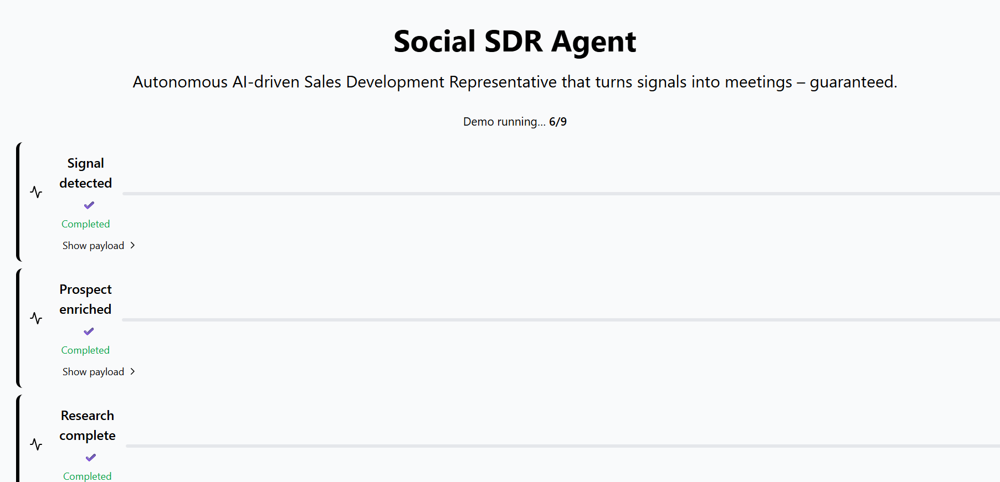

# Social SDR Agent

An AI‑powered Sales Development Representative prototype built with the **Harness Engineering Methodology**. It turns public signals into qualified prospects, generates personalized outreach, enforces human‑in‑the‑loop review, and continuously learns from outcomes—all while being fully traceable, testable, and governance‑ready.

## Live Demo
You can see a live deployed version of the frontend at: https://social-sdr-agent-bu4e.vercel.app/

## What It Does (High‑Level Flow)

1. **Signal Monitoring** – scrapes news, social feeds, intent data.  
2. **Prospect Identification** – scores signals against an Ideal Customer Profile (ICP).  
3. **Research** – enriches prospects with technographics, recent news, etc.  
4. **Outreach Generation** – creates personalized email/LinkedIn drafts.  
5. **Human Review** – mandatory approval before any message is sent.  
6. **Conversation Management** – tracks inbound/outbound messages and sentiment.  
7. **Feedback & Learning** – logs outcomes and feeds insights back into the kernel.  
8. **Governance** – runs PII detection, consent checks, and policy enforcement on every piece of data.

The system is organized around an **event bus** (in‑process for the prototype) and a **kernel** that stores intent, assumptions, evidence, reasoning, decisions, and a service registry.

## Harness Architecture & Visual Overview

The following diagram illustrates the core harnesses and their interactions via the event bus:

```mermaid
flowchart TD
    %% Core components
    subgraph Kernel[Kernel]
        Intent[Intent Store]
        Assumptions[Assumptions Store]
        Evidence[Evidence Store]
        Reasoning[Reasoning Log]
        Decisions[Decision Log]
        ServiceReg[Service Registry]
    end

    subgraph EventBus[Event Bus (In‑Process)]
        direction TB
        SignalEvent[Signal Event]
        ProspectEvent[Prospect Event]
        ResearchEvent[Research Event]
        OutreachEvent[Outreach Event]
        ReviewEvent[Review Event]
        ConvEvent[Conversation Event]
        FeedbackEvent[Feedback Event]
        GovEvent[Governance Event]
    end

    %% Harnesses
    subgraph Harnesses[Harnesses]
        SM[Signal Monitoring] -->|Emits| SignalEvent
        PI[Prospect Identification] -->|Consumes| SignalEvent
        PI -->|Emits| ProspectEvent
        R[Research] -->|Consumes| ProspectEvent
        R -->|Emits| ResearchEvent
        OG[Outreach Generation] -->|Consumes| ResearchEvent
        OG -->|Emits| OutreachEvent
        HR[Human Review] -->|Consumes| OutreachEvent
        HR -->|Emits| ReviewEvent
        CM[Conversation Management] -->|Consumes| ReviewEvent
        CM -->|Emits| ConvEvent
        FL[Feedback & Learning] -->|Consumes| ConvEvent
        FL -->|Emits| FeedbackEvent
        Gov[Governance] -->|Consumes| SignalEvent
        Gov -->|Consumes| ProspectEvent
        Gov -->|Consumes| ResearchEvent
        Gov -->|Consumes| OutreachEvent
        Gov -->|Consumes| ReviewEvent
        Gov -->|Consumes| ConvEvent
        Gov -->|Emits| GovEvent
    end

    %% Kernel interactions
    Kernel -->|Reads/Writes| EventBus
    EventBus -->|Triggers| Kernel

    style Kernel fill:#f9f,stroke:#333,stroke-width:2px
    style EventBus fill:#bbf,stroke:#333,stroke-width:2px
    style Harnesses fill:#efe,stroke:#333,stroke-width:2px
```

### Screenshot of the Demo Frontend


*The screenshot above shows the demo landing page where users can launch the full end‑to‑end flow with a single click.*

## Demo Mode (Zero‑Setup)

A one‑click **Demo Mode** walks the full pipeline with synthetic data, so you can see the entire flow without configuring any external APIs.

### How to Run the Demo Locally

1. **Clone the repo**
   ```bash
   git clone https://github.com/abhi21498/Social-SDR-Agent.git
   cd Social-SDR-Agent
   ```

2. **Backend (Python 3.11+)**
   ```bash
   # Optional: create a virtual environment
   python -m venv .venv
   source .venv/bin/activate   # Windows: .venv\Scripts\activate

   # Install dependencies (none required for the prototype, but you can add any later)
   pip install -r requirements.txt   # currently empty

   # Start the API server (respects $PORT, defaults to 8000)
   python -m TMS_Prototype.run_server
   ```
   The server will start and expose a health endpoint at `http://localhost:8000/healthz`.

3. **Frontend (Node ≥ 18, npm or yarn)**
   ```bash
   # From the repo root
   npm install          # or yarn install
   npm run dev          # starts Next.js dev server on http://localhost:3000
   ```

4. **Launch the Demo**
   - Open `http://localhost:3000` in your browser.
   - Click the **“Launch Demo”** button on the landing page.
   - The demo will automatically progress through the eight harnesses, showing status updates, and finally redirect to a dashboard view.

5. **Explore the UI**
   - **Landing page (`/`)** – executive summary, architecture highlights, demo launcher.
   - **Harness Engineering (`/harness-engineering`)** – detailed cards for each harness with purpose, inputs/outputs, responsibilities, and current status.
   - **Engineering Dashboard (`/engineering-dashboard`)** – placeholder for metrics, test coverage, knowledge growth.
   - **Architecture (`/architecture`)** – placeholder for diagrams and component interactions.
   - **Operations (`/operations`)** – placeholder for logs, health, observability.
   - **Explainability Modal** – accessible from any harness card to view the evidence, assumptions, confidence, and applied policies behind an AI decision.

## Project Structure (Key Folders)

```
/TMS_Prototype          # Backend kernel, harnesses, API, tests
/pages                  # Next.js pages (landing, demo, harness engineering, etc.)
/src/components         # Reusable UI pieces (demo button, explainability modal, event bus)
/src/utils              # Event bus implementation
/docs                   # Architecture, ADRs, verification plans, productization guides
```

## Verification & Testing

- Backend unit tests live under `TMS_Prototype/tests/`. Run them with:
  ```bash
  cd TMS_Prototype
  pytest -q
  ```
- The frontend uses TypeScript and Next.js; linting can be added later.

## Deployment Ready

The repository includes:
- `Dockerfile` (multi‑stage, copies source, respects `$PORT`).
- `Procfile` (for Heroku/Railway‑style platforms).
- `railway.json` (healthcheck `/status` – note: the healthcheck points to `/status` which maps to the `/status` endpoint; adjust if needed).
- `runtime.txt` (pins Python 3.11.15).
- `.dockerignore` (keeps build context lean).

You can deploy to any container‑friendly platform (Railway, Render, Docker Swarm, Kubernetes) with no code changes.

## Extending the Prototype

- **Real data sources** – replace the mock signal fetcher with LinkedIn, Twitter, Crunchbase, GDELT, etc.
- **Durable event bus** – swap the in‑process bus for Redis, Kafka, or RabbitMQ.
- **Model retraining hook** – attach a training pipeline to the `model_retrain_trigger` event from Feedback & Learning.
- **Auth & RBAC** – add NextAuth or similar for role‑based access.
- **Helm chart** – package the Docker image for Kubernetes.

## License

MIT – see the `LICENSE` file in `TMS_Prototype/`.

---

*Built with the Harness Engineering Methodology to ensure every decision is traceable, every component is tested, and knowledge is captured continuously.*

# Rebuild trigger 1784837877